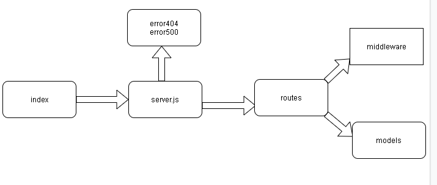

# bearer-auth
At this stage, our authentication server can allow a user to build an account and manage basic authentication (the user supplies a username and a password). If a "good" connection occurs, the user is "authenticated," and the JWT-signed "Token" is returned to the application by our authors server

## UML

## Links
https://github.com/dana-younis/bearer-auth

https://lab777.herokuapp.com/

